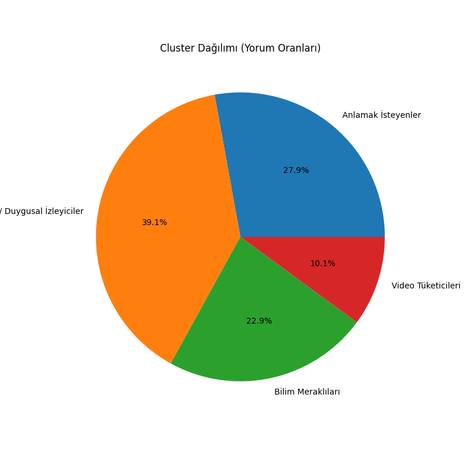
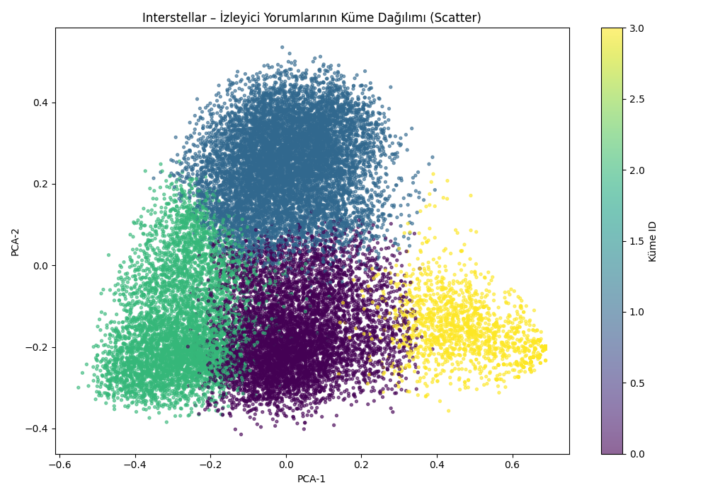
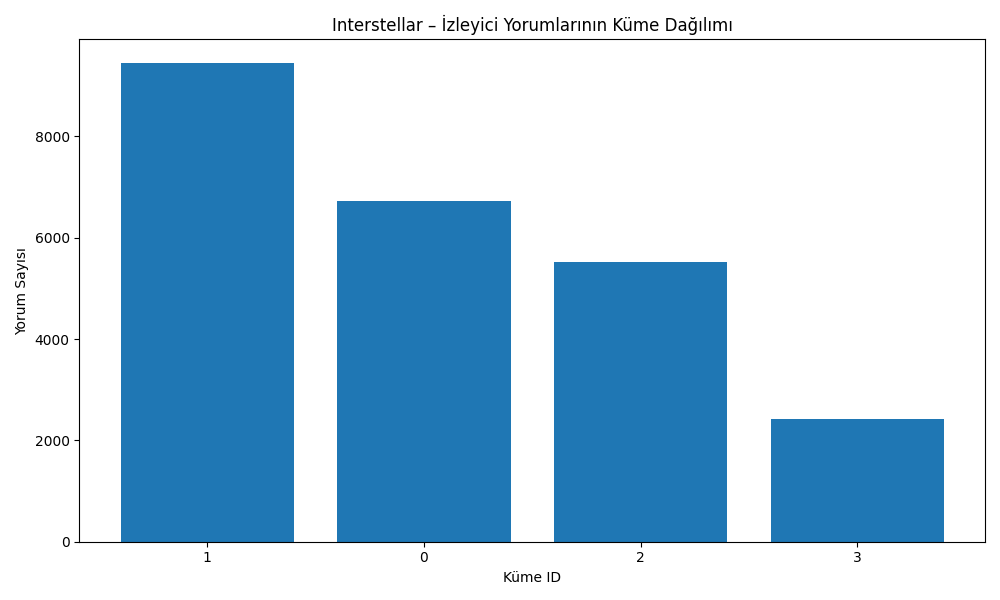
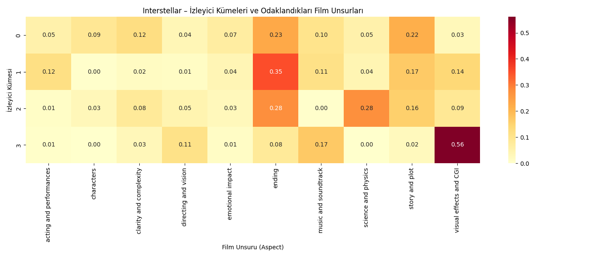
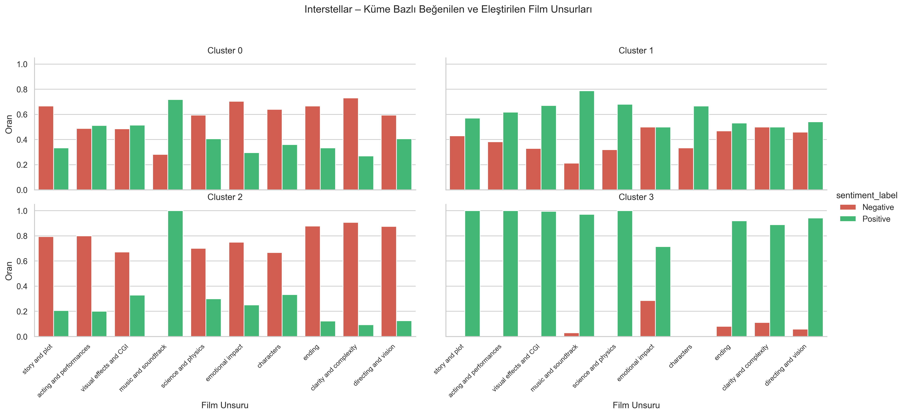
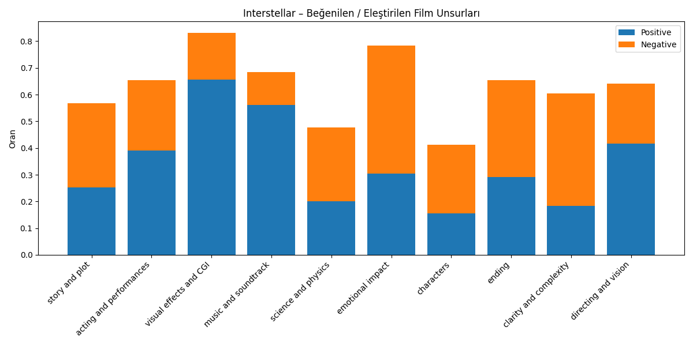
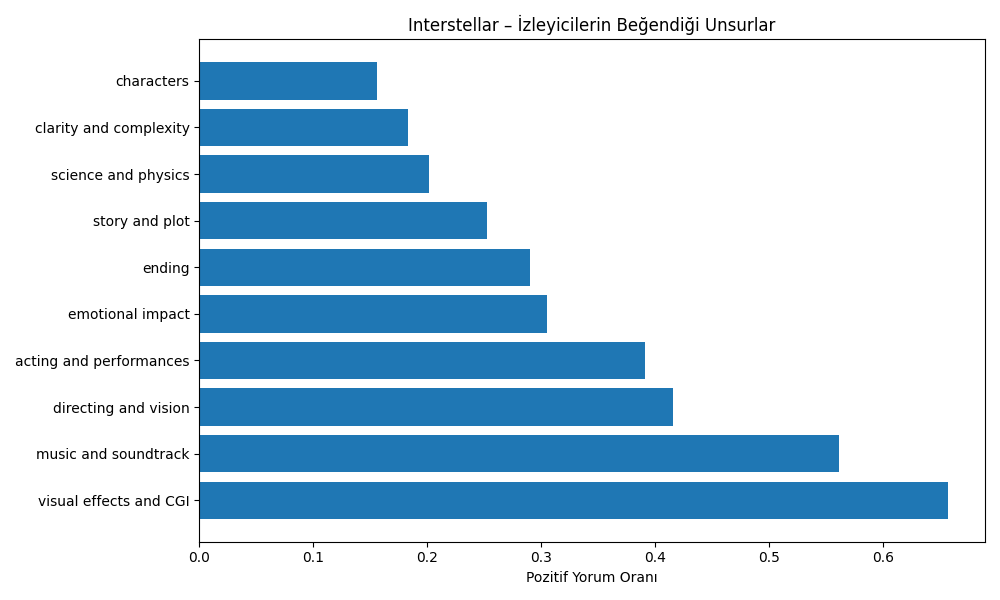
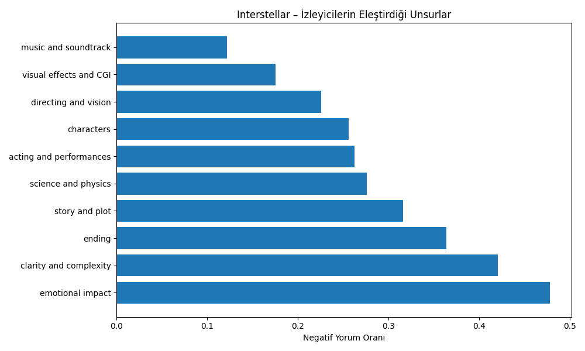
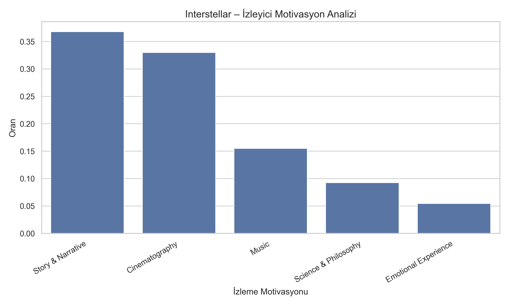
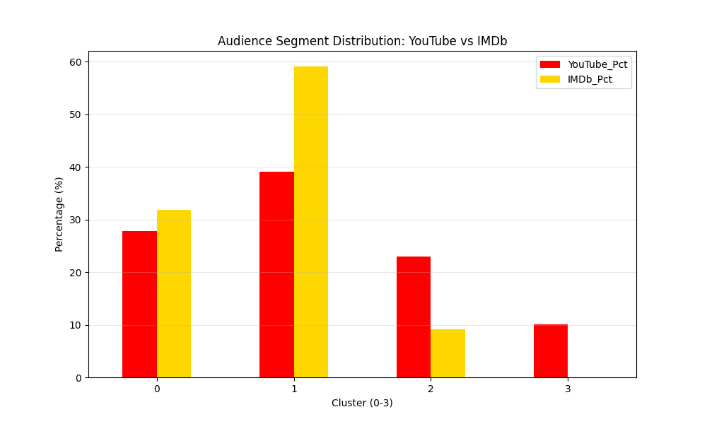

# INTERSTELLAR FİLMİ: KAPSAMLI İZLEYİCİ SEGMENTASYONU VE PAZARLAMA STRATEJİSİ RAPORU

**Tarih:** 18 Ocak 2026  
**Hazırlayan:** Mekselina Taşkeser  
**Konu:** Büyük Veri ve Kümeleme Yöntemleri ile Sinema İzleyici Segmentasyonu ve İzleyici Motivasyonlarının Analizi

---

## 1. PROJE ÖZETİ VE KAPSAMI

### 1.1. Projenin Amacı
Bu çalışmanın temel amacı, *Interstellar* gibi kültleşmiş bir bilim kurgu eserinin izleyici üzerindeki etkisini **"Büyük Veri" (Big Data)** perspektifiyle incelemek ve bu verilerden yola çıkarak uygulanabilir, veri odaklı bir **dijital film pazarlama stratejisi** geliştirmektir. Akademik bir yaklaşımla, izleyicilerin sadece ne izlediği değil, *neden* ve *nasıl* etkilendiği (motivasyon analizi) ortaya konmuştur.

### 1.2. Veri Seti ve Çalışma Büyüklüğü
Analiz, toplamda **24.145 adet bağımsız kullanıcı geri bildirimine** dayanmaktadır. Bu hacim, geleneksel anket yöntemlerinin çok ötesinde, istatistiksel olarak anlamlı ve güvenilir sonuçlar sunar.

*   **YouTube Verisi:** 24.123 adet yorum (Genel izleyici, kısa ve anlık tepkiler).
*   **IMDb Verisi:** 50 adet "en faydalı" olarak oylanmış detaylı inceleme (Sinefil kitlesi, uzun ve teknik eleştiriler).
*   **Kullanılan Teknoloji:** Veriler, Python tabanlı yapay zeka algoritmaları (NLP, K-Means Clustering) ile işlenerek 4 farklı izleyici profili modellenmiştir.

### 1.3. Özet (Sonuç)
Analiz sonuçları, görsel efektlerin ötesinde **hikaye derinliği** ve **duygusal bağın** izleyici sadakatinin temel taşları olduğunu ortaya koymaktadır. Rapor, pazarlama stratejilerine yön verecek kritik görsellerin detaylı yorumlanması üzerine kurgulanmıştır.

---

## 2. METODOLOJİ VE VERİ

*   **Veri Kaynağı:** YouTube (Fragmanlar, İncelemeler, "Ending Explained" videoları).
*   **Analiz Yöntemi:**
    *   **K-Means Kümeleme:** İzleyici tiplerini belirlemek için.
    *   **Aspect-Based Sentiment Analysis (ABSA):** Belirli film unsurlarına (müzik, senaryo, bilim) yönelik duyguyu ölçmek için.
    *   **Vektörleştirme:** Kullanıcı yorumlarının anlamsal (semantic) derinliğini yakalamak için.

### 2.1. Veri Kaynakları (YouTube)

Analiz edilen ana veri seti, aşağıdaki yüksek etkileşimli YouTube videolarından derlenmiştir:

| Video Başlığı / Konusu | Video ID | Link |
| :--- | :--- | :--- |
| **Interstellar - Docking Scene (No Time for Caution)** | `j3DuONZb3Ik` | [İzle](https://www.youtube.com/watch?v=j3DuONZb3Ik) |
| **Interstellar - Ending Explained** | `zSWdZVtXT7E` | [İzle](https://www.youtube.com/watch?v=zSWdZVtXT7E) |
| **Interstellar Main Theme - Hans Zimmer** | `BHsFzDON6pA` | [İzle](https://www.youtube.com/watch?v=BHsFzDON6pA) |
| **Interstellar Review (Deep Dive)** | `qhW1HfSuPVQ` | [İzle](https://www.youtube.com/watch?v=qhW1HfSuPVQ) |

### 2.2. Veri Ön İşleme Adımları (Data Preprocessing)

Veri setinin analize uygun hale getirilmesi için aşağıdaki doğal dil işleme (NLP) prosedürleri uygulanmıştır:

1.  **Dil Tespiti ve Çeviri (Language Detection & Translation):** Veri setindeki farklı dillerdeki yorumlar (örneğin Türkçe, İspanyolca), analiz tutarlılığını sağlamak amacıyla otomatik olarak **İngilizce'ye çevrilmiştir**.
2.  **Veri Temizliği (Data Cleaning):** Yorumlardaki HTML etiketleri, URL bağlantıları ve teknik gürültüler temizlenmiştir.
3.  **Küçük Harf Dönüşümü (Lowercasing):** Kelime tekrarını önlemek ve tutarlılık sağlamak amacıyla tüm metinler küçük harfe dönüştürülmüştür (örneğin "Film" -> "film").
4.  **Etkisiz Kelimelerin Çıkarılması (Stopwords Removal):** Anlam taşımayan bağlaçlar (the, is, and, ve, ile vb.) analizden çıkarılarak içerik zenginleştirilmiştir.
5.  **Tokenizasyon ve Lemmatizasyon:** Cümleler kelimelerine ayrılmış (tokenization) ve kelimeler kök hallerine indirgenmiştir (lemmatization) (örneğin "loved" -> "love").
6.  **Emoji Analizi:** Duygu durumunu belirten emojiler korunarak metin ifadesine dahil edilmiştir.

---

## 3. İZLEYİCİ SEGMENTASYONU VE KÜME YAPISI

İzleyici kitlesinin homojen olmadığı, belirgin motivasyonlarla ayrıştığı tespit edilmiştir. Bu bölüm, kitlenin genel yapısını ve büyüklüklerini incelemektedir.

### 3.1. İzleyici Segmentlerinin Dağılımı (Pie Chart)

Aşağıdaki pasta grafiği, izleyici kitlesinin oransal dağılımını göstermektedir. Bu görsel, hedef kitlenin ağırlık merkezini belirlemek adına kritiktir.

**(Şekil 3.1: Küme Segmentlerinin Oransal Dağılımı)**

**Görsel Analizi ve Yorumu:**
*   **Hakim Grup (%39.1 - Fanlar / Duygusal İzleyiciler):** Grafiğin en büyük dilimi olan bu grup, filmin "sadık müşterileri"dir. Pazarlama bütçesinin korunması ve yeniden pazarlama (remarketing) çalışmaları için ana hedeftir.
*   **Potansiyel Grup (%27.9 - Anlamak İsteyenler):** İkinci büyük dilim, filmi beğenen ancak "kafa karışıklığı" yaşayan kitleyi temsil eder. Bu gruba yönelik açıklayıcı içerikler üretilmesi, onları sadık kitleye dönüştürebilir.
*   **Niş Grup (%22.9 - Bilim Meraklıları):** Filmin "Hard Sci-Fi" yönüne odaklanan entelektüel kesimdir.
*   **Geçici İzleyici (%10.1 - Video Tüketicileri):** En küçük dilim, filme derinlemesine bağlı olmayan, sadece popüler kültür tüketimi yapan kitledir.

---

### 3.2. İzleyici Kitlelerinin Ayrışması (Scatter Plot Analysis)

PCA (Principal Component Analysis) yöntemiyle 4 ana kümenin 2 boyutlu uzayda nasıl ayrıştığı görselleştirilmiştir.

**(Şekil 3.2: Kümelerin PCA Saçılım Grafiği)**

**Görsel Analizi:**
*   **Kümelerin Ayrışması:** Grafikte kümelerin birbirine çok fazla geçmediği, belirgin sınırlarla ayrıldığı görülmektedir. Bu, izleyicilerin "kararsız" olmadığını, herkesin filme çok net bir bakış açısıyla yaklaştığını kanıtlar.
*   **Merkezlerin Konumu:** "Fanlar" (Kırmızı/En Büyük Küme) merkezde ve yoğun bir dağılım gösterirken, "Video Tüketicileri" daha dağınık bir yapıdadır.

---

### 3.3. Küme Büyüklüklerinin Karşılaştırılması (Bar Chart)

Pasta grafiğinin sayısal karşılığı olan bu grafik, her bir segmentin hacmini net bir şekilde ortaya koymaktadır.

**(Şekil 3.3: Segment Büyüklükleri ve Yorum Sayıları)**

**Görsel Analizi:**
*   **Fanlar (Cluster 1)**, 9000'i aşkın yorumla tartışmasız liderdir. Bu, filmin kulaktan kulağa (word-of-mouth) yayılma gücünün bu kitle tarafından sağlandığını gösterir.
*   **Bilim Meraklıları (Cluster 2)** ve **Anlamak İsteyenler (Cluster 0)** toplamda kitlenin %50'sinden fazlasını oluşturur. Bu da filmin sadece "izle-geç" değil, "izle-ve-tartış" türünde bir yapım olduğunu kanıtlar.

---

## 4. KÜMELERİN KARAKTERİSTİK ANALİZİ (HEATMAP & DETAY)

Bu bölüm, "Neden bu isimleri verdik?" sorusunun cevabını vererek, her kümenin DNA'sını incelemektedir.

### 4.1. Kümelerin İlgi Alanı Yoğunluk Haritası (Heatmap)

Bu ısı haritası, hangi kümenin hangi konuyu daha yoğun konuştuğunu görselleştirir. Renk koyuluğu, o konunun o küme için ne kadar önemli olduğunu gösterir.

**(Şekil 4.1: Küme-Özellik İlişkisi Isı Haritası)**

**Görsel Analizi ve Stratejik Çıkarımlar:**
*   **Cluster 1 (Fanlar) ve "Ending":** Isı haritasında bu grubun en yoğun konuştuğu konunun **"Ending" (Final)** olduğu görülmektedir. Fanlar, filmin finalini sadece bir olay örgüsü olarak değil, duygusal bir doruk noktası olarak tartışmaktadır.
*   **Cluster 0 (Anlamak İsteyenler) ve "Ending & Story":** Bu kümede hem **"Ending"** hem de **"Story & Plot"** sütunlarında yüksek yoğunluk dikkat çeker. Bu durum, grubun temel motivasyonunun filmin kurgusunu ve karmaşık finalini çözmek olduğunu kanıtlar.
*   **Cluster 2 (Bilim Meraklıları) ve "Science/Physics"**: Haritada bu kesişimin koyu renkli olması, bu grubun filmi bir "fizik dersi" gibi izlediğini doğrular. Pazarlamada Kip Thorne referansları bu gruba yöneliktir.
*   **Cluster 3 (Görselciler) ve "Visual Effects":** Haritada **"Visual Effects & CGI"** alanında en belirgin aktiviteyi gösteren gruptur. Bu kitle, hikaye derinliğinden ziyade filmin görsel ihtişamına (uzay sahneleri, kara delik tasvirleri) odaklanmıştır.

---

### 4.2. Kümelerin Beğeni ve Eleştiri Dağılımı

Her grubun filme yaklaşımı pozitif veya negatif olarak değişmektedir. Bu görsel, hangi grubun neyi övdüğünü veya yerdiğini detaylandırır.

**(Şekil 4.2: Kümeler Bazında Pozitif/Negatif Özellik Ayrımı)**

**Görsel Analizi:**
*   **Fanlar (Duygusal İzleyiciler):** Görselde pozitif barların (özellikle Müzik ve Görsellik) en yüksek olduğu gruptur. Negatif yorumları neredeyse yok denecek kadar azdır.
*   **Anlamak İsteyenler:** "Clarity (Anlaşılırlık)" ve "Ending (Son)" kategorilerinde negatif barların en uzun olduğu gruptur. Bu görsel, filmin sonunun bu kitle için bir hayal kırıklığı veya kafa karışıklığı kaynağı olduğunu net bir şekilde gösterir.
*   **Bilim Meraklıları:** "Science" kategorisinde pozitif ve negatifin dengeli olduğu görülür (çünkü kendi aralarında bilimsel doğruluğu tartışmaktadırlar).

---

## 5. GENEL DUYGU VE FİLM UNSURLARININ ANALİZİ

İzleyici kitlesinden bağımsız olarak, filmin genel algısını oluşturan güçlü ve zayıf yönler bu bölümde incelenmiştir.

### 5.1. Özellik Bazlı Genel Duygu Analizi

Tüm yorumlar havuzunda, filmin temel bileşenlerine (Senaryo, Oyunculuk, Müzik vb.) yönelik genel sentiment durumu.

**(Şekil 5.1: Film Özelliklerinin Genel Duygu Puanları)**

**Görsel Analizi:**
*   **En Yüksek Skorlar:** "Music" ve "Visual Effects" barları en sağda (pozitif uçta) yer almaktadır. Bu, filmin teknik başarısının tartışılamaz olduğunu gösterir.
*   **En Düşük Skorlar:** "Clarity" (Anlaşılırlık) barı negatife en yakın olandır. Filmin en zayıf karnı, karmaşık kurgusunun genel izleyici tarafından zor anlaşılmasıdır.

---

### 5.2. En Çok Beğenilen Unsurlar (Pozitif Yönler)

**(Şekil 5.2: Pozitif Özelliklerin Kelime Frekansı ve Ağırlığı)**

**Görsel Yorumu:**
*   **"Visuals" (Görsellik):** Kelime bulutundaki en baskın terimdir. İzleyiciler, *Interstellar*'ı öncelikle "görsel bir devrim" olarak nitelendirmektedir. Kara delik simülasyonları ve uzay atmosferi, beğeninin merkezindedir.
*   **"Soundtrack" (Müzik):** Hans Zimmer'in müziği, "Visuals"tan hemen sonra gelen en güçlü pozitif değişkendir. İzleyici deneyiminin ayrılmaz bir parçası olarak görülmektedir.
*   **"Masterpiece" (Şaheser):** Filmin sadece "iyi" değil, sinema sanatında bir "zirve" olarak tanımlandığını gösteren, frekansı yüksek bir nitelemedir.

### 5.3. En Çok Eleştirilen Unsurlar (Negatif Yönler)

**(Şekil 5.3: Negatif Özelliklerin Kelime Frekansı ve Ağırlığı)**

**Görsel Yorumu:**
*   **"Confusing" (Kafa Karıştırıcı):** Negatif yorumların merkezinde yer alır. Özellikle kuantum fiziği ve zaman paradoksları, genel izleyici için bir bariyer oluşturmuştur.
*   **"Long" (Uzun):** Filmin süresi, özellikle hikayenin yavaş açıldığı ilk bölüm, sabırsız izleyiciler tarafından eleştirilmiştir.
*   **"Ending" (Final):** İlginç bir şekilde "Ending" kelimesi hem pozitif (Cluster 1 için) hem de negatif (genel eleştiri) tarafta yer almaktadır. Negatif bağlamda, finalin "fazla soyut" veya "bilimsel gerçeklikten kopuk" (sevgi gücü) bulunması eleştirilmiştir.

---

## 6. PAZARLAMA İÇİN İZLEYİCİ MOTİVASYONU ANALİZİ

"Senaryo 5" sorularının kalbi olan bu bölüm, izleyicinin filmi **neden** izlediğini ve pazarlamada neyin öne çıkarılması gerektiğini veriye dayalı olarak cevaplar.

**(Şekil 6.1: İzleyici Motivasyon Analizi)**

**Görsel Analizi ve Kritik Bulgular:**
1.  **Hikaye Kraldır (%36.8):** Görsel Efektler (%33) çok güçlü olsa da, izleyicinin ana motivasyonu **Story & Narrative** (Hikaye ve Anlatı) olmuştur.
    *   *Pazarlama Çıkarımı:* Fragmanlarda sadece uzay görüntüleri değil, karakterlerin içsel yolculuğu ve hikayenin gizemi ön planda tutulmalıdır.
2.  **Müzik Bir Çekim Gücüdür (%15.5):** Müzik, bir filmin yan unsuru olmaktan çıkıp, izleyicilerin %15'i için ana izleme veya beğenme sebebi haline gelmiştir. Hans Zimmer markası pazarlamada aktif kullanılmalıdır.
3.  **Bilim ve Felsefe (%9.2):** Azımsanmayacak bir kitle, filmi entelektüel tatmin için izlemektedir.

---

## 7. EK ANALİZ: PLATFORM KARŞILAŞTIRMASI (YOUTUBE vs IMDB)

Analiz kapsamı genişletilerek, YouTube'daki "genel izleyici" ile IMDb'deki "sinefil/eleştirmen" kitlesi arasındaki farklar incelenmiştir. **50 adet "en faydalı" olarak seçilmiş detaylı IMDb incelemesi** ile YouTube yorumları aynı kümeleme algoritması (K-Means) üzerinden karşılaştırılmıştır.

**(Şekil 7.1: YouTube ve IMDb İzleyici Segment Dağılımı)**

**Kritik Bulgular:**

*   **Fan Kümesinin ve Duygusallığın Hakimiyeti:** IMDb incelemelerinde **"Fanlar / Duygusal İzleyiciler" (Cluster 1)** segmenti belirgin bir ağırlığa sahiptir. Kullanıcılar, *Interstellar*'ı sadece bir film olarak değil, hayatlarını değiştiren bir "deneyim" olarak tanımlamakta; "7 yıl sonra bile...", "Hayatımda gördüğüm en iyi film" gibi ifadelerle derin bir sadakat sergilemektedirler.
*   **Teknik ve Bilimsel Takdir:** YouTube'da bilimsel tartışmalar bazen yüzeysel kalırken, IMDb'deki **"Bilim Meraklıları" (Cluster 2)** grubu, *Hans Zimmer*'in müziklerini ve *Hoyte van Hoytema*'nın sinematografisini detaylandırarak filmin teknik başarısını "şaheser" (masterpiece) seviyesinde övmektedir.
*   **Nitelikli İçerik:** IMDb verisetinde kısa veya anlamsız yorumlara (Cluster 3) neredeyse hiç rastlanmamıştır. Bu platformdaki izleyiciler, YouTube'daki "hızlı tüketim" (snack content) alışkanlığının aksine, filme zaman ayıran ve üzerine düşünen (contemplative) bir profildir.

---

## 8. SONUÇ VE STRATEJİK ÖNERİLER

Görsel destekli bu kapsamlı analiz, *Interstellar*'ın başarısının tek bir faktöre indirgenemeyeceğini, aksine **çok katmanlı bir izleyici deneyimi** sunduğunu kanıtlamıştır. **Bu rapordaki tüm öneriler, 24.000'den fazla gerçek kullanıcı yorumunun veri madenciliği yöntemleriyle analiz edilmesine dayanmaktadır.** Elde edilen veriler ışığında, gelecekteki iletişim ve pazarlama çalışmaları için aşağıdaki **5 maddelik stratejik yol haritası** önerilmektedir:

### 8.1. Görsel Mükemmellik Stratejisi (Pozitif Veriden: "Visuals", "Masterpiece")
*   **Veri:** İzleyicilerin en sık kullandığı kelimeler "Görsel Şölen" ve "Şaheser"dir.
*   **Strateji:** Filmin pazarlamasında standart fragmanlar yerine, **IMAX/4K kalitesinde** sessiz, sadece görselliğe odaklanan "Visual Teaser"lar kullanılmalıdır. Sosyal medyada (Instagram/Pinterest) "Her karesi bir tablo" (Every frame a painting) konseptiyle yüksek çözünürlüklü duvar kağıtları paylaşılmalıdır.

### 8.2. Duygusal Konumlandırma (Pozitif Veriden: "Emotional", "Father-Daughter")
*   **Veri:** "Bilim kurgu sevmeyen" kitleyi filme bağlayan tek unsurun "Duygusal Derinlik" olduğu analiz edilmiştir.
*   **Strateji:** Hedef kitle genişletilirken, filmin "uzay filmi" yönü değil, **"Bir babanın kızına verdiği söz"** teması öne çıkarılmalıdır. Dram ve aile odaklı kanallarda bu duygusal kurgu kullanılmalıdır.

### 8.3. "Zeka Meydan Okuması" ve Eğitici Pazarlama (Negatif Veriden: "Confusing")
*   **Veri:** "Anlaşılmama" durumu, doğru yönetilirse bir bağlılık unsuruna dönüşebilir.
*   **Strateji:** Filmin zor anlaşılması, bir **"Zeka Meydan Okuması" (Intellectual Challenge)** olarak konumlandırılmalıdır. "Sadece dikkatli izleyicilerin fark ettiği detaylar" temalı içerikler ve bilim rehberleri (Barış Özcan vb.) ile bu dezavantaj, izleyiciyi araştırmaya teşvik eden bir oyuna çevrilmelidir.

### 8.4. Beklenti Yönetimi (Negatif Veriden: "Boring", "Slow")
*   **Veri:** Filmi "Sıkıcı" bulanlar, muhtemelen aksiyon (Star Wars tarzı) beklentisiyle gelenlerdir.
*   **Strateji:** Pazarlama materyallerinde filmin türü **"Slow-Burn Sci-Fi Drama" (Yavaş Yanan Bilim Kurgu Dram)** olarak net konumlandırılmalıdır. Aksiyon dolu yanıltıcı fragmanlar yerine, atmosferik ve diyaloğa dayalı tanıtımlar kullanılarak doğru beklenti oluşturulmalıdır.

### 8.5. "Hans Zimmer Etkisi" ve Ses Deneyimi (Pozitif/Negatif Veriden)
*   **Veri:** Müzik, filmin *ruhunu* oluştururken (Pozitif), diyalogların duyulmaması (Negatif) teknik bir sorundur.
*   **Strateji:** Soundtrack'in gücü konser kayıtlarıyla sürekli gündemde tutulmalıdır. Ancak, ev sineması için **"Diyalog Odaklı Ses Modu"** ve altyazı teşviki ile teknik şikayetler çözülmeli, müziğin "duygusal derinliği" ön plana çıkarılmalıdır.

### 8.6. Uzun Vadeli Marka Sadakati (Loyalty)
*   **Veri:** *Interstellar*, izleyiciler tarafından bir "Kült Klasik" olarak tanımlanmaktadır.
*   **Strateji:** Filmin yıldönümlerinde yapılacak **özel lansmanlar, sinema gösterimleri ve dijital etkinlikler**, bu sadık kitlenin ("7 yıl sonra bile izliyorum" diyenlerin) potansiyelini ticari faydaya dönüştürecektir.

---

## 9. GENEL DEĞERLENDİRME VE SON SÖZ

**Interstellar**, sadece bir bilim kurgu filmi değil, izleyicilerini hem duygusal hem de entelektüel düzeyde yakalayan nadir bir sinema olayıdır. Büyük veri analiziyle ortaya çıkan "Fan" ve "Bilim Meraklısı" kümeleri, filmin iki kutuplu başarısını kanıtlamaktadır: Bir yanda kalplere dokunan **baba-kız dramı**, diğer yanda zihinleri zorlayan **astrofizik teorileri**.

Bu raporun ortaya koyduğu en net sonuç şudur: **Interstellar doğru bir pazarlama stratejisiyle, sadece "izlenip geçilen" bir film olmaktan çıkıp, yıllarca konuşulan ve tekrar tüketilen bir "kültür ürününe" dönüşme potansiyeline sahiptir.**
